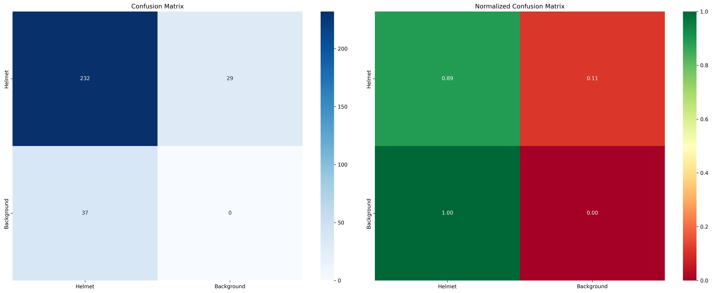
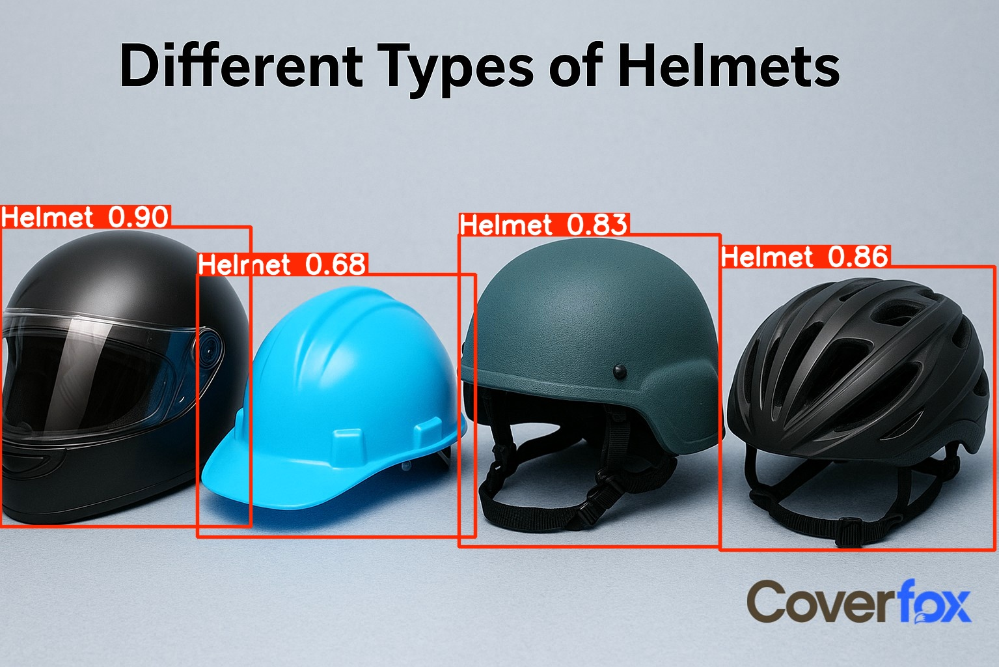
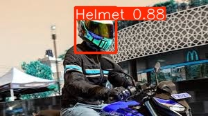

#  Helmet Detection System (YOLOv8)

A production-ready Helmet Detection System built using **YOLOv8** for detecting safety helmet compliance in images and videos. This project provides an end-to-end pipeline including dataset preparation, model training, evaluation, inference utilities, and REST API deployment.


---

##  Project Highlights

* End-to-end ML pipeline for helmet detection
* YOLOv8 model training and evaluation
* Image, video, and batch inference support
* REST API deployment with FastAPI

---

##  Deliverables

1. Model training notebook: [training_notebook.ipynb](training_notebook.ipynb)

2. Evaluation report: [evaluation_report.txt](results/evaluation/evaluation_report.txt)

3. Inference script: [Inference.py](Inference.py)

4. API endpoint:
   - Local server: [Api.py](Api.py)
   - Public deployment: [Huggingface API](https://sudhanshu03-helmet-detection.hf.space)

5. End-to-End Process Documentation: [README.md](README.md)


---

##  Project Structure

```
helmet-detection/
│
├── data/                     # Dataset 
│   ├── raw/
│   └── processed/
│
├── models/                   # Trained model weights
├── results/                  # Evaluation & inference outputs
├── runs/                     # YOLO training runs (auto-generated)
├── logs/                     # Logs and metrics
│
├── dataset.py                # Dataset setup & verification
├── preprocess.py             # Data preprocessing script
├── training.py                # Model training script
├── training_notebook.ipynb   # Model Training NoteBook
├── evaluate.py               # Evaluation pipeline
├── Model_export.py           # Model Export in Different Formats
├── inference.py              # Local inference utility
├── api.py                    # FastAPI REST API server
├── Test_api.py               # Script to test Public API on HuggingFace
│
├── requirements.txt
├── README.md
└── .gitignore
```

---

##  Installation

### 1. Clone Repository

```bash
git clone https://github.com/Sudhanshu4909/helmet-detection.git
cd helmet-detection
```

### 2. Create Virtual Environment

```bash
python -m venv venv
source venv/bin/activate   # Linux/Mac
venv\Scripts\activate      # Windows
```

### 3. Install Dependencies

```bash
pip install -r requirements.txt
```

---

## 🗂 Dataset Preparation

Before running the dataset preparation script, you must set your **Roboflow API key**, since the script downloads the dataset automatically.

Set the environment variable based on your operating system:

**Linux / macOS**

```bash
export ROBOFLOW_API_KEY=your_key_here
```

**Windows Command Prompt**

```bash
set ROBOFLOW_API_KEY=your_key_here
```

**Windows PowerShell**

```powershell
$env:ROBOFLOW_API_KEY="your_key_here"
```

Dataset should follow YOLO format:

```
data/raw/
 ├── train/
 │   ├── images/
 │   └── labels/
 ├── valid/
 │   ├── images/
 │   └── labels/
 └── data.yaml
```

After setting the API key, run the dataset preparation script:

```bash
python dataset.py
```

The script downloads the dataset, prepares directory structure, and verifies integrity before training.


##  Dataset Used

We trained our model using the **Helmet Detection (Miti4)** dataset from Roboflow Universe.

 **Dataset source:**
https://universe.roboflow.com/helmet-detection-cnnrq/helmet-detection-miti4

---

##  Model Training

Train YOLOv8 model:

```bash
python training.py
```

Outputs:

* Best model weights
* Training metrics
* Training plots
* Checkpoints

Model weights are saved under:

```
runs/detect/.../weights/best.pt
```

---

##  Model Evaluation

Run evaluation:

```bash
python evaluate.py
```

Evaluation includes:

* mAP metrics
* Precision & recall
* Confusion matrix
* Evaluation report

##  Confusion MAtrix Of the Trained Model:
<p align="center">
  
</p>

---

##  Inference Usage

### Image Inference

```bash
python inference.py --type image --source path/to/image.jpg
```

### Video Inference

```bash
python inference.py --type video --source video.mp4
```

### Batch Inference

```bash
python inference.py --type batch --source images_folder/
```

Results are saved under:

```
results/inference/
```

##  Sample Inference Results

The repository includes example outputs generated by the trained model.  

Example detections produced by the model:
<p align="center">
  
  
  
</p>


---

##  REST API Deployment

Start API server:

```bash
python api.py
```

API available at:

```
http://localhost:8000
```

### Health Endpoint

```
GET /health
```

### Image Prediction

```
POST /predict
```

Example:

```bash
curl -X POST http://localhost:8000/predict \
  -F "file=@image.jpg"
```

### Base64 Prediction

```
POST /predict/base64
```

### Batch Prediction

```
POST /predict/batch
```

### Public API Deployment (Hugging Face Spaces)

The trained model and REST API are publicly deployed and accessible at:

🔗 https://sudhanshu03-helmet-detection.hf.space

The API root exposes the following information:

```json
{
  "message": "Helmet Detection API",
  "model": "helmet_detector_best_20260216_163341.pt",
  "endpoints": {
    "health": "/health",
    "predict": "/predict",
    "predict_base64": "/predict/base64",
    "batch_predict": "/predict/batch"
  }
}

# Health check
curl https://sudhanshu03-helmet-detection.hf.space/health

# Single image prediction
curl -X POST https://sudhanshu03-helmet-detection.hf.space/predict \
  -F "file=@image.jpg"

# Base64 image prediction
curl -X POST https://sudhanshu03-helmet-detection.hf.space/predict/base64 \
  -H "Content-Type: application/json" \
  -d '{"image_base64":"<base64_string>","conf_threshold":0.25}'

# Batch prediction
curl -X POST https://sudhanshu03-helmet-detection.hf.space/predict/batch \
  -F "files=@image1.jpg" \
  -F "files=@image2.jpg"

```

---

##  Model Performance

| Metric       | Value |
| ------------ | ----- |
| mAP@0.5      | 90%+  |
| mAP@0.5:0.95 | ~60%  |
| Precision    | ~94%  |
| Recall       | ~81%  |


---
